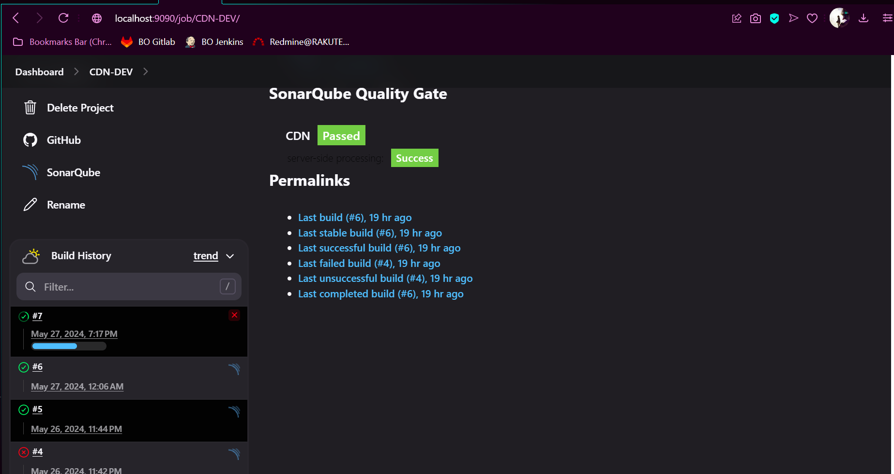
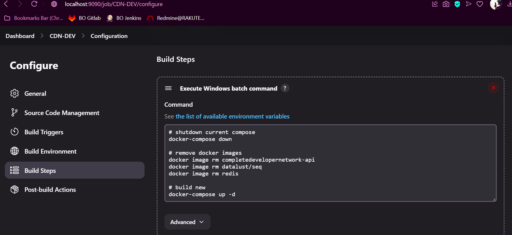
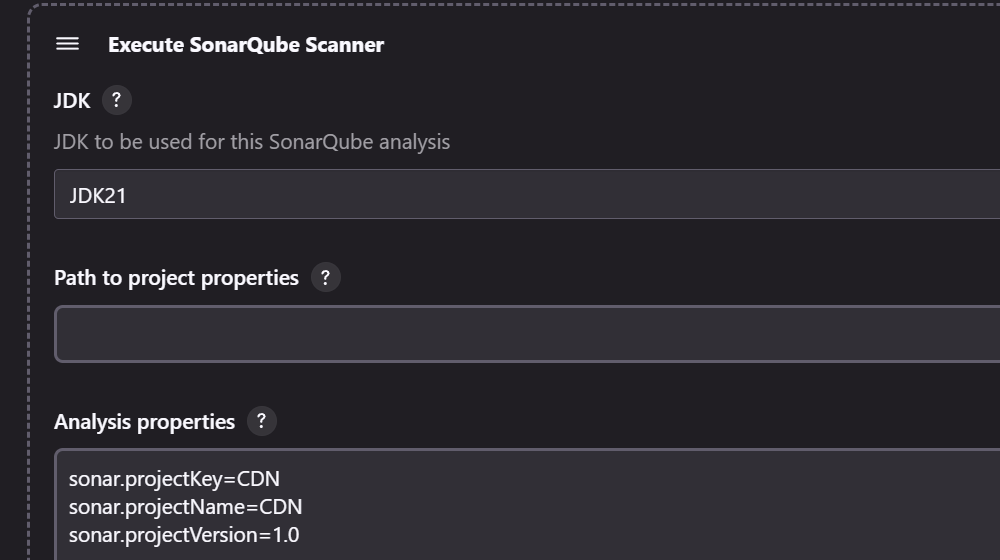
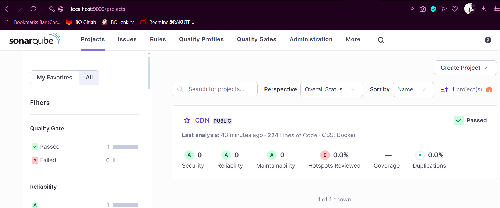

# Project CDN

## Getting Started
### Requirements

> 1. Docker Desktop
> 2. Postman (optional)


### Steps to run API
> 1. Clone this repository
> 2. CD into the project directory
> 3. Make sure Docker Desktop is running
> 4. run command: docker-compose up -d
> 5. Open URL : [Swagger](http://localhost:5001/swagger/index.html)


## Description
- Database - SQLite
- Cache - Redis (Docker)
- Logging - Serilog, Seq (Docker)
- CI/CD - Jenkins (Host machine) & SonarQube (Docker)

### Why SQLite?

```
- Lightweight and uses less resources
- Easier to deploy and manage
```

### Caching 
```
- For this project the caching is using lazy loading for the most part
- Only 1 instance of Redis, no Sentinel or Clustering setup
```

### Logging
> For logging, this project is using Serilog and the logs are sent to Seq


### CI/CD

>  To demonstrate this, I am using Jenkins and SonarQube that is installed on my windows machine
>1. The dashboard

>2. Source code configuration

>3. Build steps

>4. SonarQube setup in Jenkins

>5. SonarQube 
